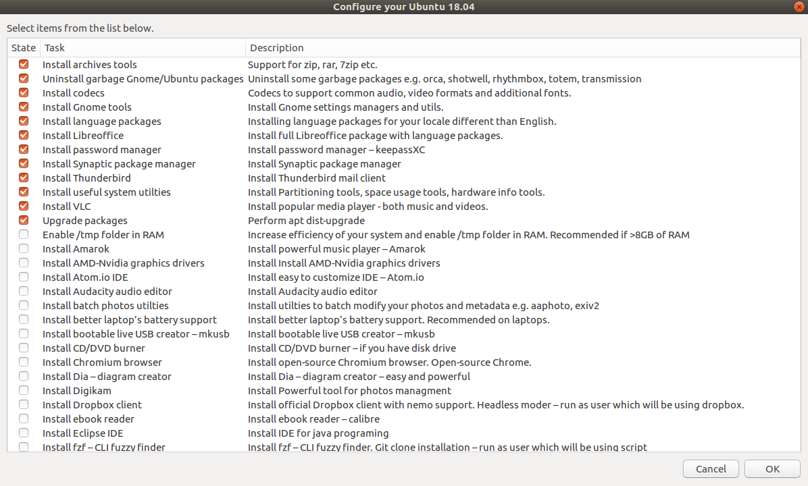
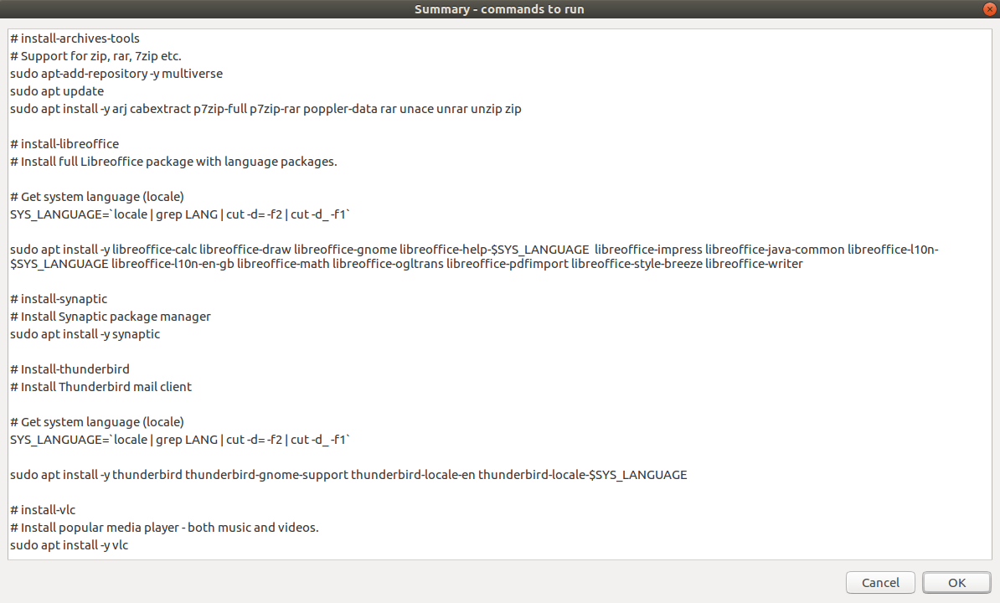

# Description
The script enables installation and configuration of some essential apps and utilties that make your Ubuntu more useful and powerful.
Script is using `zenity` graphical interface, which is preinstalled by default with new Ubuntu Bionic Beaver 18.04.

# Usage
```bash
# Clone repo
git clone https://github.com/wiktor2200/Ubuntu-1804-firstrun-config.git
cd Ubuntu-1804-firstrun-config
```
**Then run main script:**
```bash
# Run main config script
bash ubuntu-1804-firstrun-config.bash
```
# Screenshots
Main menu:


Example summary:


## Features
Full feature list from [config.csv](./Develop/config.csv) file in `Develop` directory in easy readable table.

2019-06-21

|Task|Description|Subscript|
|---|---|---|
|Install archives tools|Support for zip, rar, 7zip etc.|[install-archives-tools](/scripts/install-archives-tools)|
|Uninstall garbage Gnome/Ubuntu packages|Uninstall some garbage packages e.g. orca, shotwell, rhythmbox, totem, transmission|[uninstall-garbage-packages](/scripts/uninstall-garbage-packages)|
|Install codecs|Codecs to support common audio, video formats and additional fonts.|[install-codecs](/scripts/install-codecs)|
|Install Gnome tools|Install Gnome settings managers and utils.|[install-gnome-tools](/scripts/install-gnome-tools)|
|Install language packages|Installing language packages for your locale different than English.|[install-language-packages](/scripts/install-language-packages)|
|Install Libreoffice|Install full Libreoffice package with language packages.|[install-libreoffice](/scripts/install-libreoffice)|
|Install password manager|Install password manager – keepassXC|[install-password-manager](/scripts/install-password-manager)|
|Install Synaptic package manager|Install Synaptic package manager|[install-synaptic](/scripts/install-synaptic)|
|Install Thunderbird|Install Thunderbird mail client|[install-thunderbird](/scripts/install-thunderbird)|
|Install useful system utilties|Install Partitioning tools, space usage tools, hardware info tools.|[install-system-utilties](/scripts/install-system-utilties)|
|Install ClamAV Antivirus|Install and configure ClamAV Antivirus|[install-antivir](/scripts/install-antivir)|
|Install VLC|Install popular media player - both music and videos.|[install-vlc](/scripts/install-vlc)|
|Upgrade packages|Perform apt dist-upgrade|[perform-upgrade](/scripts/perform-upgrade)|
|Enable /tmp folder in RAM|Increase efficiency of your system and enable /tmp folder in RAM. Recommended if >8GB of RAM|[enable-tmp-ram](/scripts/enable-tmp-ram)|
|Install Amarok|Install powerful music player – Amarok|[install-amarok](/scripts/install-amarok)|
|Install AMD-Nvidia graphics drivers|Install Install AMD-Nvidia graphics drivers|[install-amd-nvidia-drivers](/scripts/install-amd-nvidia-drivers)|
|Install Visual Studio Code IDE|Install Visual Studio Code - easy, customizable and powerful IDE for almost all languages.|[install-vs-code](/scripts/install-vs-code)|
|Install Atom.io IDE|Install easy to customize IDE – Atom.io|[install-atom](/scripts/install-atom)|
|Install Audacity audio editor|Install Audacity audio editor|[install-audacity](/scripts/install-audacity)|
|Install batch photos utilties|Install utilties to batch modify your photos and metadata e.g. aaphoto, exiv2|[install-photo-utils](/scripts/install-photo-utils)|
|Install better laptop's battery support|Install better laptop's battery support. Recommended on laptops.|[install-battery-support](/scripts/install-battery-support)|
|Install bootable live USB creator – mkusb|Install bootable live USB creator – mkusb|[install-mkusb](/scripts/install-mkusb)|
|Install CD/DVD burner|Install CD/DVD burner – if you have disk drive|[install-cd-dvd-burner](/scripts/install-cd-dvd-burner)|
|Install Chromium browser|Install open-source Chromium browser. Open-source Chrome.|[install-chromium](/scripts/install-chromium)|
|Install Dia – diagram creator|Install Dia – diagram creator – easy and powerful|[install-dia](/scripts/install-dia)|
|Install Digikam|Install Powerful tool for photos managment|[install-digikam](/scripts/install-digikam)|
|Install Dropbox client|Install official Dropbox client with nemo support. Headless moder – run as user which will be using dropbox.|[install-dropbox](/scripts/install-dropbox)|
|Install ebook reader|Install ebook reader – calibre|[install-calibre](/scripts/install-calibre)|
|Install Eclipse IDE|Install IDE for java programing|[install-eclipse](/scripts/install-eclipse)|
|Install fzf – CLI fuzzy finder|Install fzf – CLI fuzzy finder. Git clone installation – run as user which will be using script|[install-fzf](/scripts/install-fzf)|
|Install Guake – gnome dropdown terminal|Install Guake – gnome dropdown terminal|[install-guake](/scripts/install-guake)|
|Install Simple HEX editor - ghex|Install simple Gnome hex editor.|[install-hex-gnome-editor](/scripts/install-hex-gnome-editor)|
|Install Powerful HEX editor – bless|Install hex editor - bless - more powerful, but needs more dependencies. – bless.|[install-hex-bless-editor](/scripts/install-hex-bless-editor)|
|Install Inkscape – vector graphic editor|Install vector graphic editor – Inkscape|[install-inkscape](/scripts/install-inkscape)|
|Install ISO images tool|Install ISO images tool, mount, unmount, modify. - acetoneiso|[install-acetoneiso](/scripts/install-acetoneiso)|
|Install Nextcloud client|Install Nextcloud client.|[install-nextcloud](/scripts/install-nextcloud)|
|Install OCR Reader|Install utilties to OCR read files.|[install-ocr](/scripts/install-ocr)|
|Install Owncloud client|Install Owncloud client.|[install-owncloud](/scripts/install-owncloud)|
|Install PDF tools|Install utilties to support pdf modifications  - merging, spliting, replacing pages etc.|[install-pdf-tools](/scripts/install-pdf-tools)|
|Install Qalculate scientific calculator|Install Qalculate scientific calculator|[install-qalculate](/scripts/install-qalculate)|
|Install QownNotes|Install notepad with markdown support and todo list manager supporting sync.|[install-qownnotes](/scripts/install-qownnotes)|
|Install qtCreator IDE|Install IDE for qt programs|[install-qtcreator](/scripts/install-qtcreator)|
|Install sandboxing app – Firejail|Install sandboxing app Firejail.|[install-firejail](/scripts/install-firejail)|
|Install scanner support|Install utilties to support scanner in Ubuntu.|[install-scanner-support](/scripts/install-scanner-support)|
|Install sysadmin network utilties|Install utilties to monitor network traffic e.g. nethogs, nmap, iftop, whois, net-tools etc.|[install-sysadmin-network-tools](/scripts/install-sysadmin-network-tools)|
|Install task manager – TaskCoach|Install powerful task manager TaskCoach|[install-taskcoach](/scripts/install-taskcoach)|
|Install Tellico – collections manager|Install Tellico – collections manager – books, movies, coins etc.|[install-tellico](/scripts/install-tellico)|
|Install VirtualBox|Install Virtualbox virtual machines manager.|[install-virtualbox](/scripts/install-virtualbox)|
|Install Docker|Install Docker from snap package manager.|[install-docker](/scripts/install-docker)|
|Install Slack|Install Slack team collaboration tool from snap package.|[install-slack](/scripts/install-slack)|
|Install webcam application|Install webcam application – cheese|[install-webcam-cheese](/scripts/install-webcam-cheese)|
|Remove swapfile|Removing of swapfile is recommended when using ssd drive - to increase it's life. When swap is off hibernation is disabled!|[remove-swapfile](/scripts/remove-swapfile)|
|Replace notepad gedit with pluma|Replace default gedit with powerful pluma notepad.|[replace-gedit-pluma](/scripts/replace-gedit-pluma)|
|Replace filemanager Nautilus with Nemo|Replace file manager Nautilus with more powerful Nemo|[replace-nautilus-nemo](/scripts/replace-nautilus-nemo)|
|Replace default snap packages with native Gnome apps.|Replace default snap packages with native Gnome apps.|[replace-snap-packages](/scripts/replace-snap-packages)|
|Show hidden autostart system entries|Show hidden autostart system entries|[show-hidden-autostart-entries](/scripts/show-hidden-autostart-entries)|
|Set Grub Timeout to 1 second|Set Grub Timeout to 1 second|[set-grub](/scripts/set-grub)|
|Uninstall Ubuntu dock|Uninstall annoying Ubuntu Gnome dock.|[uninstall-ubuntu-dock](/scripts/uninstall-ubuntu-dock)|
|Uninstall Ubuntu 16.04 old dependencies.|Uninstall 16.04 garbage dependencies after upgrade to 18.04.|[uninstall-old-1604-dependencies](/scripts/uninstall-old-1604-dependencies)|
|Fix top panel icons|Fix top panel icons on systems upgraded from 16.04|[fix-top-panel-icons](/scripts/fix-top-panel-icons)|
|Clean packages|Perform apt autoremove, clean and autoclean|[perform-cleanup](/scripts/perform-cleanup)|


# Documentation for development of the script

## Autogenerator of main script
Main script was autogenerated using script [generate-script-from-config.bash](/Develop/generate-script-from-config.bash) in `Develop` directory.

### Generation script workflow
Generation script workflow looks like following:
1. Read `config.csv` file for:
  * `state` (TRUE/FALSE),
  * `task` - task name,
  * `description` - description of task
2. Then subscripts folder and files are created (if not exist)
3. Generate `zenity` main checklist menu.
4. Generate `case` function for zenity checklist output.
5. Generate rest of code to provide `zenity` summary and errors windows.
6. Manually replace feature list in `README.md` with content of generated file: [feature_list.md](/Develop/feature_list.md)

### Autogenerator usage (for adding new features)
Modify `./Develop/config.csv` file and run:
```bash
bash ./Develop/generate-script-from-config.bash
```
After that, fill in new subscripts in `scripts` folder (if you've added one) and that's all.
